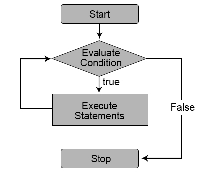
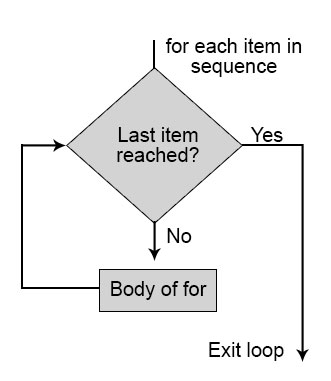

# Introduction Loops in Python

A concept in Python programming package that allows repetition of certain steps,
or printing or execution of the similar set of steps repetitively,
based on the keyword that facilitates such functionality being used,
and that steps specified under the keyword automatically indent accordingly is known as loops in python.
It is acting as a block, with “while” continuing to execute until a certain specified condition is met
and “for” executing till the index variable in the specified range of values reaches its final value.

Looping is a common phenomenon in any programming language;
From a python perspective, the powerful programming language offers two broad categories of loops.

They are as below:

While Loops

For loops

# While Loops
The common strategy behind while loops are they execute a set of statements until the given condition is satisfied.
The next statement call happens at the instance when the specified condition is satisfied.
The use of indented code segments determines the segment or the body of the loop.Indentation starts the loop,
and the line from which it starts to be unindented represents the end of the mentioned loop.
All non-zero values are interpreted as true here.



### Code Snippet
```
n = 20 # condition
guests = 0 
i = 1 # indexing var

while i <= n:
    guests += 1
    i += 1
print(guests)

```

# For Loops
For traversing a sequential statement set, these loops are implied.
The persistence of the loop is passed on pending the last item in the series is executed.
While loop here to the content of the loop is separated from the rest of the code by introducing the indentation.
As like while loop here to indentation plays an important role in determining the body of the loop involved.
Indentation starts the loop, and the line from which it starts to be unindented represents the end of the mentioned loop.



### for loop structure
```
for iterator_var in sequence:
statements(s)
```
### Code Snippet
```
fruits = ["apple", "banana", "cherry"]

for x in fruits:
  print(x)
```
The for loop does not require an indexing variable to set beforehand.

### Looping Through a String
Even strings are iterable objects, they contain a sequence of characters:
```
for x in "banana":
  print(x)
```
### The break Statement
With the break statement we can stop the loop before it has looped through all the items:

```
fruits = ["apple", "banana", "cherry"]
for x in fruits:
  print(x)
  if x == "banana":
    break
```

Exit the loop when x is "banana", but this time the break comes before the print:
```
fruits = ["apple", "banana", "cherry"]
for x in fruits:
  if x == "banana":
    break
  print(x)
```

### The continue Statement
With the continue statement we can stop the current iteration of the loop, and continue with the next:

```
fruits = ["apple", "banana", "cherry"]
for x in fruits:
  if x == "banana":
    continue
  print(x)
```

### The range() Function
To loop through a set of code a specified number of times, we can use the range() function,
The range() function returns a sequence of numbers, starting from 0 by default,
and increments by 1 (by default), and ends at a specified number.

```
for x in range(6):
  print(x)
```

Note that range(6) is not the values of 0 to 6, but the values 0 to 5.

The range() function defaults to 0 as a starting value,
however it is possible to specify the starting value by adding a parameter: range(2, 6),
which means values from 2 to 6 (but not including 6):

```
for x in range(2, 6):
  print(x)
```

The range() function defaults to increment the sequence by 1,
however it is possible to specify the increment value by adding a third parameter: range(2, 30, 3):

```
for x in range(2, 30, 3):
  print(x)
```

### Else in For Loop
The else keyword in a for loop specifies a block of code to be executed when the loop is finished:

```
Print all numbers from 0 to 5, and print a message when the loop has ended:

for x in range(6):
  print(x)
else:
  print("Finally finished!")
```

Note: The else block will NOT be executed if the loop is stopped by a break statement.

Break the loop when x is 3, and see what happens with the else block:

```
for x in range(6):
  if x == 3: break
  print(x)
else:
  print("Finally finished!")
```

### Nested Loops
A nested loop is a loop inside a loop.

The "inner loop" will be executed one time for each iteration of the "outer loop":

```
Print each adjective for every fruit:

adj = ["red", "big", "tasty"]
fruits = ["apple", "banana", "cherry"]

for x in adj:
  for y in fruits:
    print(x, y)
```

### The pass Statement
for loops cannot be empty, but if you for some reason have a for loop with no content, put in the pass statement to avoid getting an error.

```
for x in [0, 1, 2]:
  pass
```